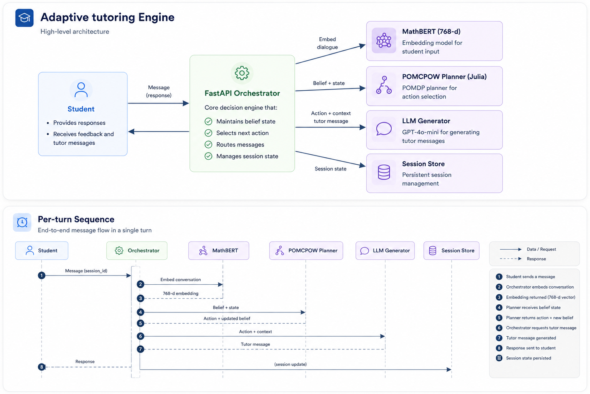
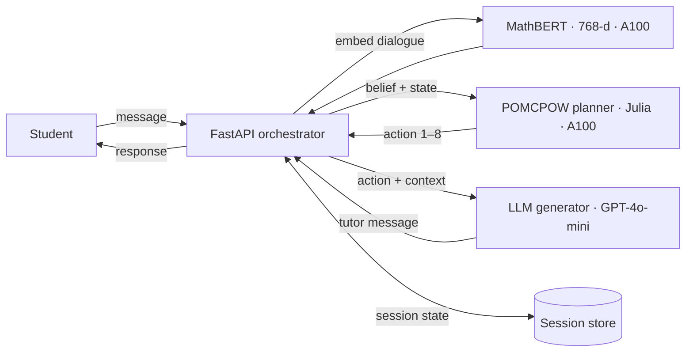
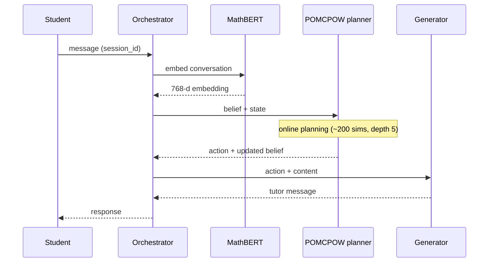
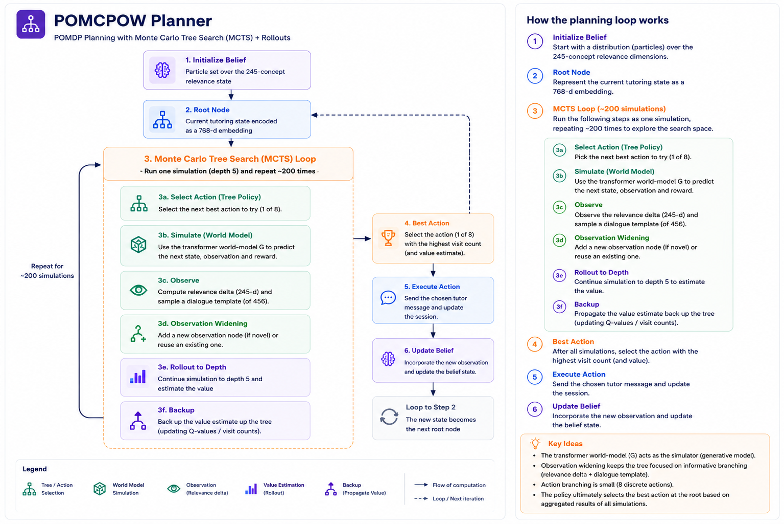
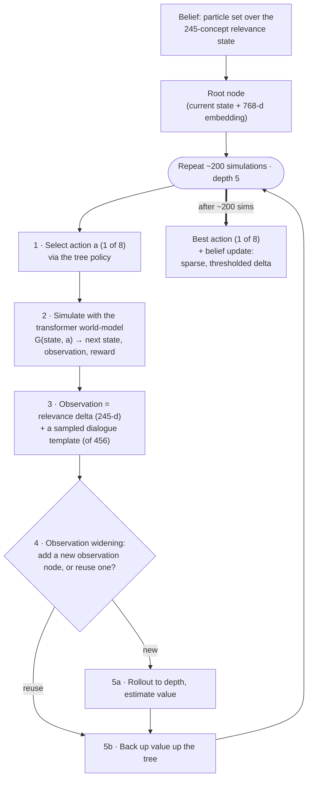

# Adaptive Tutoring Engine

*An RL tutor that plans over what a student doesn't understand — not just what they asked.*

> **Status:** research prototype. Not a hardened production system, and not yet evaluated for learning outcomes (see [Limitations & Future Work](#limitations--future-work)).

A general-purpose LLM answers the question you typed. An expert tutor does something harder: they infer the *shape* of your confusion — including the parts you can't articulate — and decide what to do about it. This project models that second job as a **POMDP**: it maintains a belief over a student's mastery of each calculus concept and plans the next pedagogical move (probe, guide, correct, …), with an LLM handling only the final wording. The aim is to close the gap between a generalist answer-engine and a tutor who lays groundwork and directs you with real understanding of where you're stuck.

---

## Architecture



The Julia layer is the **planner only** — it receives a precomputed 768-dim embedding plus concept features and returns an action (1–8) and a belief update. Dialogue embedding (MathBERT) and text generation (GPT-4o-mini) live in the surrounding Python/Modal layer; the planner never embeds dialogue or generates text.

<details><summary>Diagram source (Mermaid)</summary>

**System**



**Per turn**



</details>

---

## Design Decisions

**POMDP, not MDP — because understanding is hidden.** An MDP assumes fully observed states; a student's understanding never is. "Understanding" is too abstract to track in general, but inside a bounded domain like elementary calculus it decomposes into a finite concept set, and per-concept difficulty becomes a quantity you can hold a belief over. The partial observability is the whole point.

**A planner, not just a prompt — for interpretability and probing.** Prompting yields a good general answer to the question asked, but does little to model what you don't know that you don't know, and nothing structured to probe understanding at the concept level. The policy acts against an explicit, inspectable belief over concepts — a transparent basis for tutoring decisions rather than opaque generation. *(Written when LLMs probed less actively; see Limitations.)*

**Turn-level, not token-level — for real-time speed.** Tutoring conversations get long, and token-level modeling over that history is too slow to be interactive on a modest GPU budget. Working at turn granularity — with dialogue templates standing in for raw text, so the model reads sentiment and direction rather than words — keeps planning fast enough to feel live.

**POMCPOW — for a large observation space.** The observation (per-concept relevance deltas plus a distribution over hundreds of templates) is high-dimensional, so vanilla POMCP's observation branching explodes; POMCPOW's observation widening handles it. The choice followed reading on sufficient statistics and Rao–Blackwellization — the goal was a principled belief-estimation method, not an ad-hoc heuristic.

**Sparse, thresholded belief deltas — for a learnable signal.** Predicting the full 245-dim relevance vector exactly is a hard target; predicting that a *few* concepts moved is far better-conditioned. Belief updates are delta-based and thresholded to match that training sparsity.

**Embeddings out of the planner, templates cached — for fast search.** Dialogue is embedded once per turn in the orchestration layer and passed to the planner ready-made; the planner never embeds during tree search. Template embeddings are built once and cached (loaded from a baked-in cache in production), so rollouts reuse them instead of re-embedding.

**Generator swapped Claude → GPT-4o-mini — for cost.** Final wording is the commodity layer; competing on raw generation quality wasn't the point or the budget. The planner — the novel part — is generator-agnostic, so the swap cut generation cost ~96% with the architecture untouched.

**Stateless planner + session affinity — for safe scaling.** One student's integral lesson must not steer another's derivative lesson, so requests route by session to a consistent container and persistent state lives in an external store; the planner stays stateless, letting containers scale without cross-contamination.

---

## How Planning Works



Each `/plan` call runs an online POMCPOW search from the student's current belief. The **transformer world-model is the simulator**: given a (state, action) pair it predicts the next observation — a relevance delta over the 245 concepts plus a sampled dialogue template — and a reward, so the planner can look ahead with no real student in the loop. Because that observation space is high-dimensional, **observation widening** caps the branching (with only 8 discrete actions, action branching is small) — which is exactly why POMCPOW is used over vanilla POMCP. After ~200 simulations it returns the best of the eight actions and a sparse, thresholded belief update.

<details><summary>Diagram source (Mermaid)</summary>



</details>

---

## Results & Status

Operational characteristics (measured):

- belief over **245** calculus concepts; **456** dialogue templates; **8** pedagogical actions
- planner: POMCPOW, **~200 simulations/turn**, tree depth 5, discount 0.95
- latency: **~1–2 s/turn**
- generation: GPT-4o-mini, **~$0.14 / 1000 turns**; swapping the generator from Claude Sonnet cut generation cost **~96%** (≈2.3× faster) with the planner unchanged
- serving footprint: **~$12.60/hr** (A100 planner + A100 MathBERT + CPU orchestrators)
- world-model training/validation loss is logged at checkpoint load

**Not yet measured: learning outcomes.** The system optimizes a *proxy* — its belief over concept mastery — and has not been evaluated against actual student learning. The training/validation loss above measures model fit, not tutoring efficacy. A real efficacy study is the top item under Future Work.

---

## Quickstart

> The Julia layer is the **planner only**: it takes a precomputed 768-dim `dialogue_embedding` and `x_features` in the request body and returns an action + relevance delta. The caller always supplies the embedding — the planner never embeds dialogue itself.

### Local (planner in isolation)

**A — Canonical: `pomcpow_server.jl` + bundled cache (no MathBERT needed).**
Loads the precomputed `template_embeddings_cache.jld2` at startup; mirrors production.

```bash
# checkpoint isn't in the repo — pull it from the Modal volume first
modal volume get principia-models /sequential_dialogue_final-v4_epoch_30.jld2 planner/checkpoints/
cd planner
julia pomcpow_server.jl 8080   # default checkpoint path: checkpoints/sequential_dialogue_final-v4_epoch_30.jld2
```

Prereqs: Julia 1.10 and the package set (`POMDPs`, `POMCPOW`, `POMDPTools`, `BasicPOMCP`, `ParticleFilters`, `Flux`, `CUDA`, `BSON`, `JLD2`, `JSON`/`JSON3`, `HTTP`, `Statistics`, `Distributions`, `StatsBase`) — install with `julia planner/install.jl`. CUDA is optional — CPU fallback, just slower.

**B — Regenerate embeddings: `local.jl` + live MathBERT.**
Recomputes all 456 template embeddings at startup, so start the embedding service first:

```bash
python serving/mathbert_server.py --port 8081
cd planner
julia local.jl 8080
```

**Either way**, exercise the planner:

```bash
curl http://localhost:8080/health
curl -X POST http://localhost:8080/plan -H 'Content-Type: application/json' -d '{
  "problem_text": "Find the derivative of x^2 sin(x)",
  "dialogue_embedding": [ /* 768 floats */ ],
  "turn_count": 1,
  "x_features": [ 1.0 /* + 245 concept relevances */ ]
}'
# -> { action, relevance_delta[245], reward, turn_count, speaker_next }
```

### Modal (full pipeline: MathBERT + planner + generator)

```bash
pip install modal && modal token new
modal secret create openai-secret OPENAI_API_KEY=...
modal secret create anthropic-secret ANTHROPIC_API_KEY=...   # services still declare this secret
modal volume put principia-models sequential_dialogue_final-v4_epoch_30.jld2 /sequential_dialogue_final-v4_epoch_30.jld2
modal deploy serving/modal_app.py
```

Then POST to the returned endpoint:

```bash
curl -X POST <your-endpoint-url> -H 'Content-Type: application/json' -d '{
  "message": "Find the derivative of x^2 sin(x)",
  "session_id": "user-123",
  "new_session": true
}'
```

The first deploy is slow (Julia + CUDA image build and precompile); the container startup timeout is set generously to absorb it. In steady state, warm pools keep planner/MathBERT containers ready so turns don't pay a cold start.

|  | Local (A or B) | Modal |
|---|---|---|
| Runs | planner only | full pipeline |
| You provide | `dialogue_embedding` + `x_features` | just `message` + `session_id` |
| MathBERT | none (A) / `:8081` (B) | managed |
| Generation | none | GPT-4o-mini |
| GPU | optional (CPU fallback) | A100 |
| Checkpoint | local `planner/checkpoints/…jld2` | `principia-models` volume |

---

## Limitations & Future Work

**Limitations**

- **No learning-outcome evaluation.** The system optimizes a proxy (its belief over concept mastery); there is no measured evidence it improves actual learning.
- **The "planner over prompting" premise predates current LLMs.** It assumed a plain LLM gives generic answers and does little to probe understanding; stronger modern models may narrow that gap, so the comparison deserves re-testing.
- **Belief grounding is indirect.** Updates come from a learned model over dialogue-template *sentiment*, not from verified assessment of the student's actual work — the tracking is only as rigorous as the transition/observation model and the template→action mappings.
- **Coarse observations.** Mapping free dialogue onto 456 fixed templates discards nuance; the model reads template sentiment, not content.
- **Hand-built, single-subject ontology.** The 245 concepts were enumerated by hand for elementary calculus; another subject means re-specifying the set, and quality is bounded by it.
- **Cold start.** Early in a session the belief is uninformative, so the first few tutoring decisions rest on weak evidence.
- **Research system, not hardened.** Slow first-deploy image build/precompile, a 30 s plan timeout, and OpenSSL/CUDA workarounds.

**Future Work**

- Run a real efficacy study: A/B against a strong LLM-tutor baseline with pre/post assessment.
- Ground belief updates in the student's actual worked answers (parse/verify the math) rather than template sentiment.
- Learn the belief-update model end-to-end from interaction logs; add a learned value function to cut planning sims and latency.
- Generalize beyond calculus by auto-extracting concept graphs for new subjects.
- Re-benchmark the prompt-only baseline against current frontier LLMs.

---

## Tech Stack

| Layer | Stack |
|---|---|
| Planner | Julia 1.10 · POMDPs.jl · POMCPOW · POMDPTools · BasicPOMCP · ParticleFilters |
| World-model | Flux — turn-level transformer (transition + observation model) |
| Embeddings | MathBERT (`tbs17/MathBERT`), 768-dim |
| Generation | GPT-4o-mini (OpenAI) |
| Serving | Modal (A100) · FastAPI orchestrator · custom socket server (OpenSSL workaround) |
| State & artifacts | Modal volumes (checkpoints) · Modal Dict (session store) · JLD2 / BSON |
| Runtimes | Python 3.11 · Julia 1.10 · CUDA |

---

## References

- Kaelbling, L. P., Littman, M. L., & Cassandra, A. R. (1998). *Planning and Acting in Partially Observable Stochastic Domains.* Artificial Intelligence, 101(1–2), 99–134.
- Sunberg, Z. N., & Kochenderfer, M. J. (2018). *Online Algorithms for POMDPs with Continuous State, Action, and Observation Spaces.* ICAPS. arXiv:1709.06196.
- Shen, J. T., Yamashita, M., Prihar, E., Heffernan, N., Wu, X., & Lee, D. (2021). *MathBERT: A Pre-trained Language Model for General NLP Tasks in Mathematics Education.* NeurIPS 2021 MATHAI4ED Workshop. arXiv:2106.07340.